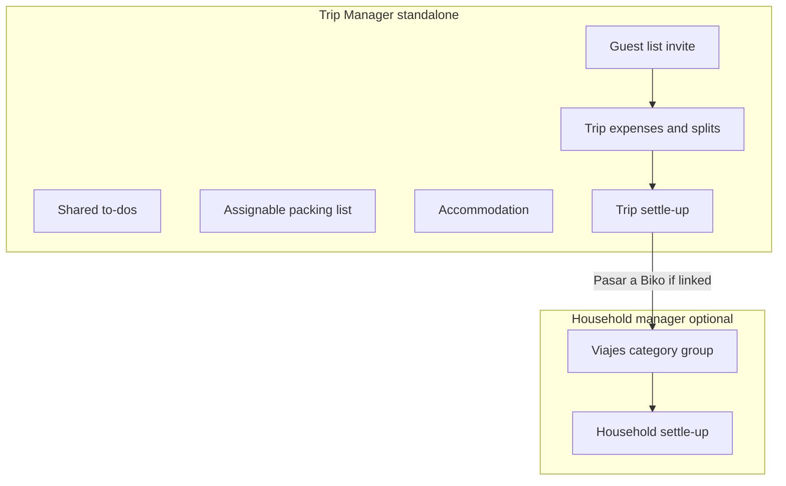
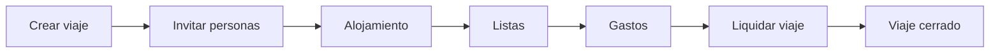
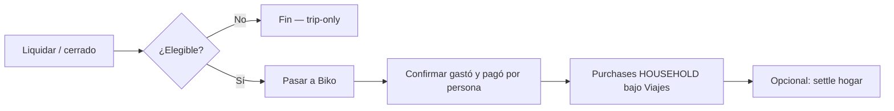

# Biko Trip Manager — Product Requirements (PRD)

## Context

Biko today is a household expense PWA for Argentina (couple-first): purchases, splits, cuotas, promos, and settle-up. **Viajes** exists only as a seeded expense category/group—there is no Trip entity.

**Trip Manager (Gestor de viajes)** is a first-class product surface in Biko: a time-bound shared workspace for a trip (couple or friends). It is **usable on its own**—plan, list, split, and settle the trip without ever opening household Gastos, dashboard, promos, or household settle-up.

**Household integration is optional and additive.** When a user also uses the household manager, they can **Pasar a Biko** and land the household share under Viajes with category mix. That bridge must stay clean; trip core must not depend on it.

It is **not** a full Wanderlog clone (maps, AI itineraries, photo albums). Differentiation: complete trip loop *plus* an optional path into household books—not a trip feature trapped inside household finance.

**Related docs**
- Engineering brief (schema, API, screens): [`docs/trip-manager-eng-brief.md`](./trip-manager-eng-brief.md)
- Household product brief: [`docs/project-brief.md`](./project-brief.md)



---

## Standalone vs integration (locked principle)

| Principle | Meaning |
|-----------|---------|
| **Complete without household** | Create trip → invite → lodge → lists → expenses → liquidar trip → done. No household purchase, category, or balance required. |
| **No forced household UX** | Guests and trip-only users never see hogar totals, promos, or “tu pareja” flows. |
| **Optional bridge** | “Pasar a Biko” appears only when the actor has an active household finance context and chooses to export. Closing a trip does not require export. |
| **Integration unbroken** | Export still creates idempotent household purchases under Viajes with category %, using the same allocation mental model. Trip data remains source of truth until export. |
| **Domain decoupling** | Trip entities own their money and lists. They do not FK-require `Purchase` / household settle for CRUD. Export writes *into* household; household never owns the trip. |

---

## Trip vs household boundaries

This section is the product contract for ownership, auth, navigation, and what guests never see. Engineering must treat these as hard constraints, not soft preferences.

### Ownership

| Rule | Detail |
|------|--------|
| **Trip owner** | `Trip` is owned by **`createdByUserId`** (the organizer), **not** by `householdId`. |
| **No household FK for core ops** | Creating, editing, inviting, listing, settling, and closing a trip must work without a required `householdId` on the trip. |
| **Export metadata only** | Optional `exportHouseholdId` / export batch metadata appear **only** when Pasar a Biko runs—not at trip create. |
| **Auth/tenant caveat** | If the product still requires a technical Household row for every User today, that is an auth/tenant detail: **product behavior must not require using household expense features.** Prefer evolving toward user-owned trips if household-as-container blocks standalone UX. |
| **Household never owns the trip** | Export writes purchases *into* the household ledger. The household does not become the trip’s parent. Trip records remain the source of truth until (and after) export. |

### Auth and guest join

| Rule | Detail |
|------|--------|
| **Trip invite ≠ household invite** | Shareable invite code/link may mirror household invite UX patterns, but joining a trip **only** adds the person to the trip roster. |
| **No auto-join hogar** | Claiming a trip invite must **not** auto-join any household. |
| **Guest traveler** | Joins via invite; trip-only experience. MVP: lightweight join (display name + optional account). |
| **Registered trip member** | Full trip permissions except Pasar a Biko unless they have household finance context. |
| **Roles (v1)** | **Organizer** (create, invite, close trip, optional Pasar a Biko if eligible) vs **Member** (edit trip content). Creator is default organizer. |

### Navigation

| Surface | Role |
|---------|------|
| **`/viajes`** | Primary trip list (active first, then closed). **Trip-first landing**—viable as “home” for someone who never opens Resumen/Gastos. |
| **`/viajes/:id`** | Trip hub: **Resumen · Gastos · Listas · Alojamiento · Personas**. |
| **Más** | Discoverable entry for household-first users (link to Viajes / Gestor de viajes). |
| **Bottom nav** | Guests and trip-only sessions must not be forced into household chrome (partner balance, promos, cuotas). Trip hub is self-contained. |

### When “Pasar a Biko” appears

Shown **only** when **all** of the following hold:

1. The actor is an **organizer** (or otherwise export-eligible role).
2. The actor has an **active household finance context** (can create `HOUSEHOLD`-scoped purchases in their hogar).
3. The trip is **liquidated or closed** (or explicitly allowed from a closed trip)—export is never required to close.
4. The trip (or the actor’s share) has **not already been fully exported** for that household (idempotent; no double-count CTA).

**Not shown** to guests, trip-only members without household context, or as a blocking step after **Liquidar viaje**.

Failure or skip of export **must not** block closing the trip or undoing trip settle.

### What guests never see

Guests (and trip-only sessions without household context) **never** see:

- Household **Resumen** totals / partner balance (“tu pareja” flows)
- Household **Gastos** ledger, cuotas, or payment-method chrome
- **Promos** catalog or “Hoy” recommendations
- Household **settle-up** / deudas between hogar members
- **Pasar a Biko**
- Household invite, settings that manage the hogar, or any implication that joining the trip joined the household

They **do** see: trip Resumen, Gastos (trip-scoped), Listas, Alojamiento, Personas (trip roster + invite copy if permitted).

---

## Problem and opportunity

| Today | Pain |
|--------|------|
| WhatsApp + spreadsheet + Splitwise/Tricount | Trip spend and lists scattered; no single trip home |
| Biko `Viajes` category | Flat tag; no trip dates, members, or category mix |
| `/juntada` | Ephemeral equal split; no persistence, lists, or lodging |
| Guests outside the hogar | No first-class participants; only Contacts/Debts |
| Coupling risk | If trips only work “through” household finance, friends and trip-only use die |

**Jobs to be done**

1. **Standalone:** “When we travel with friends, we plan what to do and bring, track who paid what, and settle fairly—without needing a household expense app.”
2. **Integrated (optional):** “If we already use Biko at home, we can send our share of the trip into Viajes with category mix, without retyping.”

---

## Personas

1. **Trip organizer** — Creates and runs the trip; may or may not use household Biko. Primary success path is a closed, settled trip.
2. **Trip member (registered)** — Account used mainly for trips; full trip permissions except export-to-household unless they have household context.
3. **Household partner** — Uses both surfaces; can optionally Pasar a Biko so the hogar ledger reflects the trip.
4. **Guest traveler** — Joins via invite link; trip-only experience. **Does not** join the household. MVP: lightweight join (name + optional account).
5. **Out of scope for v1:** kids accounts, agency roles, multi-household co-ownership of one trip.

**Default decision:** Trips are **group-capable** and **household-agnostic**. Couple trips and friend trips use the same model. Household membership is irrelevant until someone opts into export.

---

## Core features (v1 scope)

### 1. Trip expenses and split payments

**Trip expense categories (fixed set for v1)** — UI labels inside the trip:

| Trip category (UI) | Examples |
|--------------------|----------|
| Alojamiento | Hotel, Airbnb, hostel |
| Vuelos | Flights |
| Transporte | Taxi, Uber, rent-a-car, bus, fuel |
| Comida / supermercado | Groceries, market runs |
| Restaurantes | Eating out |
| Tickets / actividades | Museums, tours, shows |
| Otros | Misc |

**Behaviors**

- Log amount, **one or more payers** (trip members with amounts summing to the total), category, optional note, date, currency (ARS default; multi-currency as display-only or single FX rate per trip in v1.1).
- Split modes **reuse the same algorithms** as household expenses (equal, by %, by shares, by amount, assign to subset)—shared library in [`packages/shared/src/expense-allocation.ts`](../packages/shared/src/expense-allocation.ts), not a runtime dependency on household purchases. Allocations (who owes) are separate from payments (who paid).
- Running balances: who owes whom **within the trip** (simplify transfers on settle; same idea as [`packages/shared/src/settle-up.ts`](../packages/shared/src/settle-up.ts) / `/juntada`, trip-scoped). **Paid** = sum of payment rows; **share** = sum of allocations.
- Trip spend dashboard: total by category (%), by person (paid vs share).
- Trip settle-up (**Liquidar viaje**) is the **primary money close**. It is complete without any household action.

**Optional bridge — Pasar a Biko (Viajes)**

1. Trip members settle among themselves first (trip settlements are sufficient to close the trip).
2. **Pasar a Biko** is optional. Shown only to eligible users (see boundaries above).
3. Export creates household `Purchase`(s) scoped `HOUSEHOLD` under the **Viajes** group. Amounts are the hogar members’ **consumed share by trip category** (not the whole trip’s mix %). **Share** (allocations) is each hogar member’s trip allocations in that category; members who were not on the trip get $0. **Paid** comes from those members’ trip payments in the category, scaled so household paid sums to household share (friends’ over/under-pay stays in trip settle). A purchase has a single payer, so two hogar payers in the same category become two purchases in that Viajes subcategory.
4. Expand Viajes into a **Viajes group** with subcategories (see [Viajes taxonomy](#viajes-taxonomy-seed--category-groups)) so household dashboards still roll up Viajes while mix stays queryable.
5. Export is idempotent (link exported purchases; don’t double-count). Unexported / never-exported trips remain valid forever as trip-only records.
6. Failure or skip of export **must not** block closing the trip or undoing trip settle.

### 2. Shared list of things to do

- Collaborative checklist / idea board: title, optional notes, optional date/day, done/undone.
- Any trip member can add, edit, complete.
- Optional soft assign (“quién organiza”) — not required for v1.
- Not a full day-by-day itinerary with maps (backlog).

### 3. Shared list of things to bring / buy (assignable)

- Items with: name, quantity optional, status (pending / done), **assignee** (trip member or unassigned).
- Separate sections or type flag: **Traer** vs **Comprar** (same list UX, filter by type).
- Templates later (playa, montaña, camping)—backlog.

### 4. Guest list, claim, and trip-household groups

- Trip has a **guest list** of participants (any trip members—not “household + guests” as hierarchy).
- Organizer can **pre-create travellers** (named slots, `userId` null, pending) before anyone has an account.
- Shareable **invite code/link** (trip invite, not household invite). On join, the invitee can **claim** an unclaimed slot (“¿Quién sos?”) or add themselves as “Otro / no estoy en la lista”.
- Joining adds/claims a trip roster seat only; they see expenses, lists, accommodation—**never** household Gastos/promos/balance.
- **Trip-household groups** (named groups on the trip, e.g. “Los García”) are trip-internal only—not Biko hogar membership. Organizer assigns travellers into groups.
- **Settlement units:** balances and Liquidar aggregate per trip-household group (paid + share roll up); ungrouped travellers stay individual units. Expense payments may be multi-member; allocations may stay per-member. Pasar a Biko (Biko hogar) is unchanged when eligible.
- Roles as above. Guests cannot Pasar a Biko or see household finances.

### 5. Trip accommodation

- One primary stay in v1 (enough for most couple/weekend trips): name/label, **address**, check-in / check-out dates, optional link (Airbnb/booking), optional notes (door code—treat as sensitive).
- Optional **cost** is a real trip expense in category **Alojamiento** (linked via `TripAccommodation.expenseId`), equal-split among PENDING+JOINED by default; counts in Gastos and balances (not metadata-only). Clear cost → remove the linked unexported expense. Multi-payer / custom split editable from Gastos.
- Trip-level fields: name, destination (free text), start/end dates (may match or wrap stay dates).
- Multi-stay / multi-city: backlog.

### 6. Trip shell (implied, required)

- Create / list / open trips; status: `planning` → `active` → `closed`.
- Closed trips are read-only except reopen by organizer. **Closed ≠ exported.**
- Entry points: dedicated `/viajes` (primary for trip-first users) and discoverable from **Más** for household-first users.

---

## Viajes taxonomy (seed + category-groups)

### Current state (cross-check)

| Location | Today |
|----------|--------|
| [`apps/api/prisma/seed.ts`](../apps/api/prisma/seed.ts) | Single global category `{ name: 'Viajes', icon: '✈️', color: '#4a7fb5' }` among flat household categories. |
| [`packages/shared/src/category-groups.ts`](../packages/shared/src/category-groups.ts) | Group `id: 'viajes'` with `categoryNames: ['Viajes']` only. |
| Statement heuristics | Scrapers may still map travel keywords → category name `Viajes` (catch-all remains useful). |

**Constraint:** `resolveCategoryGroupId` maps each **exact** category name to one group. Existing names like `Transporte`, `Restaurante`, `Supermercado`, and `Otros` already belong to other groups. Trip export subcategories **must not reuse those names**, or spend would leave the Viajes rollup.

### Proposed seed categories (global)

Keep existing **`Viajes`** as catch-all (maps to trip UI **Otros**, and keeps statement import / legacy purchases working). Add subcategories with distinct names that roll exclusively into the Viajes group:

| Trip UI category | Seed `Category.name` | Icon | Color (suggested) | Notes |
|------------------|----------------------|------|-------------------|--------|
| Alojamiento | `Alojamiento` | 🏨 | `#4a7fb5` | New; no name collision today. |
| Vuelos | `Vuelos` | ✈️ | `#3d6f9e` | New. |
| Transporte | `Movilidad viaje` | 🚕 | `#5b8a9e` | Distinct from household `Transporte`. |
| Comida / supermercado | `Comida viaje` | 🛒 | `#4f8a5b` | Distinct from `Supermercado` / Comida group. |
| Restaurantes | `Restaurantes viaje` | 🍽️ | `#b5567a` | Distinct from `Restaurante` / `Delivery`. |
| Tickets / actividades | `Actividades` | 🎟️ | `#8a5b9e` | New. |
| Otros | `Viajes` | ✈️ | `#4a7fb5` | **Existing** seed row; catch-all + legacy. |

### `category-groups.ts` mapping

Update the `viajes` group to:

```ts
{
  id: 'viajes',
  name: 'Viajes',
  icon: '✈️',
  color: '#4a7fb5',
  categoryNames: [
    'Alojamiento',
    'Vuelos',
    'Movilidad viaje',
    'Comida viaje',
    'Restaurantes viaje',
    'Actividades',
    'Viajes', // catch-all / Otros
  ],
}
```

Household dashboards continue to roll up all of these under **Viajes**; drill-down shows the mix.

### Pasar a Biko mapping

When exporting, for each trip expense category the **hogar actually consumed**, create household purchase(s) whose `categoryId` resolves to the seed name above.

- Absolute amount per category = sum of allocations of hogar members on the trip in that category (not trip-wide % × net share).
- Split = `AMOUNT` with each hogar user’s share (including $0 for members not on the trip).
- Payer = the hogar member(s) who paid that category on the trip (payments scaled to the hogar share). Multiple payers → one purchase per payer, same subcategory. If nobody in the hogar paid, still record consumption with the exporter as payer.

| Trip category (UI) | → Household category name | → Group |
|--------------------|---------------------------|---------|
| Alojamiento | `Alojamiento` | Viajes |
| Vuelos | `Vuelos` | Viajes |
| Transporte | `Movilidad viaje` | Viajes |
| Comida / supermercado | `Comida viaje` | Viajes |
| Restaurantes | `Restaurantes viaje` | Viajes |
| Tickets / actividades | `Actividades` | Viajes |
| Otros | `Viajes` | Viajes |

**Idempotency:** link each export batch (and optionally each source `TripExpense`) to created `Purchase` ids so re-running Pasar a Biko does not double-count.

**Migration note for implementers:** seed the new global categories; expand `CATEGORY_GROUPS` viajes `categoryNames`; leave existing purchases tagged `Viajes` as-is (they remain in the group via the catch-all name).

---

## Competitive research — features to consider

Sources: Splitwise, Wanderlog, WePlanify, LetsPackUp, TravelDeck, Tripsil, Plan Our Trip, Tricount, TripIt.

| Feature | Seen in | Verdict for Biko |
|---------|---------|------------------|
| Expense split + balances | Splitwise, Tricount, Wanderlog, most group apps | **Core v1** |
| Category breakdown / budget cap | Wanderlog, LetsPackUp | Budget cap = **v1.1**; categories = **v1** |
| Packing + to-do lists | Wanderlog, WePlanify, LetsPackUp | **Core v1** |
| Assignable tasks | WePlanify, Tripsil | Packing assign = **v1**; task board = later |
| Invite link / guests | All group apps | **Core v1** |
| Lodging on trip | Wanderlog, LetsPackUp | **Core v1** (simple) |
| Day-by-day itinerary + maps | Wanderlog, Tripsil, WePlanify | **Phase 2** — high effort, weak fit vs Biko money DNA |
| Polls / voting on activities | WePlanify | **Phase 2** |
| Group chat | Tripsil | **Out** — users already use WhatsApp |
| Photo album / memories | TravelDeck, Tripsil | **Out** for now |
| Email import of bookings | TripIt, Wanderlog | **Out** — fragile; manual lodging fields enough |
| Multi-currency + FX | Splitwise Pro, Wanderlog | **v1.1** (trip base currency + rate) |
| Offline access | Tripsil, Plan Our Trip, Biko PWA | Leverage existing offline outbox for expense add **v1.1** |
| AI packing / itinerary | Wanderlog, TravelDeck | **Later / optional** |
| Document wallet (tickets PDFs) | TravelDeck | **Phase 2** |
| Minimize settlement transfers | TravelDeck, Splitwise | **v1** (reuse settle-up simplification) |
| Live flight status | TripIt / Wanderlog Pro | **Out** |

**Differentiation for Biko:** Trip Manager stands alone like Splitwise/Wanderlog-lite for group trips; when the user also runs household Biko, the wedge is **optional Pasar a Biko → Viajes with category mix** (and later cuotas/promos on exported purchases)—without making household finance a gate.

---

## UX flows

### Information architecture

- `/viajes` — trip list (active first, then closed); viable as landing for trip-first users
- `/viajes/:id` — trip hub tabs: **Resumen · Gastos · Listas · Alojamiento · Personas**
- `/viajes/invitar/:code` (or equivalent) — join flow for invite link
- Discoverable from **Más** → Viajes / Gestor de viajes

**Visual:** same PWA system as Biko, but trip hub must not surface household chrome to guests or trip-only sessions. Mobile-first; 2–3 taps to add expense.

**Key empty states:** “Todavía no hay gastos”, “Invitá al grupo con el link”, “Nada que traer todavía”, “Viaje liquidado” (without pushing export).

### Standalone happy path



**Step list**

1. **Crear viaje** — name, destination, start/end dates, base currency ARS → lands on trip hub Resumen.
2. **Personas** — copy invite link; members/guests join roster only.
3. **Alojamiento** — one primary stay (address, check-in/out, optional booking link/notes).
4. **Listas** — add Hacer items; add Traer / Comprar with optional assignee.
5. **Gastos** — FAB add expense (amount, one or more payers, category, split, note, date); Resumen updates totals and balances.
6. **Liquidar viaje** — show minimized transfers (reuse settle-up simplification); record trip settlements; mark trip closed (read-only).
7. **Done** — no household action required. Empty/closed copy: “Viaje liquidado” without pushing Pasar a Biko.

### Optional Pasar a Biko path



**Step list**

1. After **Liquidar viaje** (or from a closed trip), eligible organizer sees secondary CTA **Pasar a Biko**.
2. Confirm preview: household share, per-category amount, and each hogar member’s **pagó / gastó**.
3. Create idempotent `HOUSEHOLD` purchases under Viajes group; link export metadata on the trip.
4. User may later use normal household settle-up; that is independent of trip settle.
5. Skip / failure → trip remains valid; no double-count on retry.

### Key screens / tabs

| Tab | Content | Primary actions |
|-----|---------|-----------------|
| **Resumen** | Dates, destination, total spent, category pie/%, trip balances | **Liquidar viaje**; conditional **Pasar a Biko** |
| **Gastos** | Expense feed | FAB add (fast entry; may share UI patterns with household form, **not** the household ledger) |
| **Listas** | Toggle Hacer / Traer-Comprar; assignee chips | Add / complete / assign |
| **Alojamiento** | Address (maps deep-link out), dates, link, notes | Edit stay |
| **Personas** | Guest list, roles, invite link copy | Invite / manage roster |

---

## Domain model (conceptual)

See full engineering brief: [`docs/trip-manager-eng-brief.md`](./trip-manager-eng-brief.md).

Ownership and coupling (summary):

- `Trip` owned by `createdByUserId`; no required `householdId` for core ops.
- Trip money entities are **not** subclasses of `Purchase`.
- Shared **code** OK (`expense-allocation`, `settle-up`); shared **data** and **required screens** are not.
- Optional link after export: `TripExpense.exportedPurchaseId` / export batch id.

---

## Recommended backlog (post-v1), prioritized

**P1 — soon after MVP**

- Trip budget target + progress by category
- Multi-currency with one trip FX rate
- Packing templates
- Multiple accommodations / stops
- Push notifications on new expense / assignment (reuse Web Push)

**P2 — planning depth**

- Day-by-day itinerary (no maps first)
- Activity polls
- Attach receipt photo to trip expense
- Export PDF summary for the group

**P3 — nice-to-have**

- Maps / route optimization
- AI packing suggestions
- Shared photo gallery
- Booking email parse

**Explicitly out of product for Trip Manager**

- In-app chat, open banking, becoming a destination discovery app

---

## Success metrics

**Standalone (primary)**

- Closed trips with trip settle completed (with or without export)
- Trip expenses / list items per active trip
- Guest join completion from invite link
- % of trip users who never open household Gastos (healthy, not a failure)

**Integration (secondary, must stay healthy)**

- Of eligible closed trips, % that use Pasar a Biko
- Export success / zero double-count incidents
- Time from trip close → export when chosen
- Viajes household spend attributable to a trip (qualitative / linked ids)

---

## Delivery phases (for engineering later)

| Phase | Ships |
|-------|--------|
| **MVP** | Standalone trip shell, members/invite, accommodation (1), expenses+splits+trip balances, lists, trip settle; **optional** Pasar a Biko → Viajes group + category % |
| **v1.1** | Budget, FX, offline add, templates, notifications |
| **v2** | Multi-stay, light itinerary, polls, receipts, PDF |

---

## Open assumptions (locked for this spec)

1. Lives in the Biko app/repo, Spanish UI (**Viajes / Gestor de viajes**), but is a **standalone product loop**.
2. Guests are trip members only—never household members by virtue of the trip.
3. Trip settle does not require household finance. **Pasar a Biko** is optional and only for users with household context.
4. v1 is **checklists + trip money + lodging**, not itinerary/maps/chat.
5. Viajes taxonomy expands so *when* export happens, category percentages land cleanly in the household ledger.
6. Shared libraries OK; trip CRUD and close must not depend on `Purchase` or household settle existing for that trip.

---

## Spec checklist (deliverables)

| Todo | Covered in |
|------|------------|
| Full product PRD | This document |
| Standalone / trip vs household boundaries | [Trip vs household boundaries](#trip-vs-household-boundaries) |
| Viajes subcategory seed + mapping | [Viajes taxonomy](#viajes-taxonomy-seed--category-groups) |
| UX flows (standalone + Pasar a Biko) | [UX flows](#ux-flows) |
| Engineering brief | [`docs/trip-manager-eng-brief.md`](./trip-manager-eng-brief.md) |
